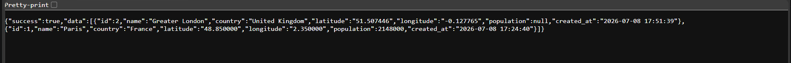
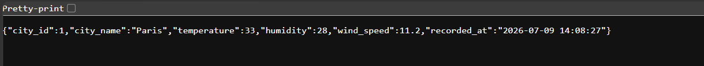
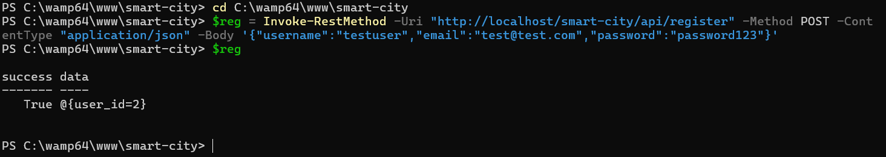
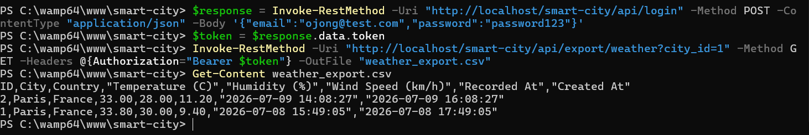
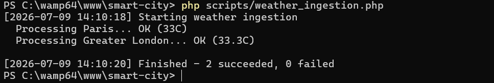

# Smart City Dashboard — Backend Architecture & Integration

**Ojong Bessong NKONGHO — Student 6**
B3 Web Technologies — DSTI School of Engineering, Paris — 2025/2026

---

## What this branch contains

This is my contribution to the group project. My responsibility was the backend infrastructure — the router, the database connection, the shared response format, the authentication middleware — and integrating everyone else's modules into a single working application.

Every HTTP request goes through `index.php`, gets matched by the router, and reaches the right controller. Every response comes back in the same JSON structure. Every protected endpoint goes through the same middleware. That consistency is what this branch is about.

---

## Why I built it this way

When I looked at what teammates had started, each module was handling things differently — different response formats, different ways of connecting to the database, no shared routing. That would have made frontend integration messy.

I introduced two things to fix it: a `Response` class that every controller uses to send data back, and a central `Router` that registers all routes in one place. Once those existed, plugging in each teammate's module was straightforward — they just had to follow the same constructor pattern and use the same response methods.

The database connection was also scattered. I centralised the credentials in `config/config.php` so there is one place to update when the environment changes, and one PDO instance shared across the whole request.

---

## Project structure

```
smart-city/
├── index.php                   ← every request starts here
├── .htaccess                   ← sends everything to index.php
├── database.sql                ← full schema, run this first
│
├── config/
│   ├── config.php              ← db credentials and base path
│   └── Database.php            ← one PDO connection shared across the request
│
├── core/
│   ├── Router.php              ← matches method + path, calls the controller
│   └── Response.php            ← success/error, same format every time
│
├── middleware/
│   └── AuthMiddleware.php      ← reads the Bearer token, blocks if invalid or expired
│
├── backend/
│   ├── controllers/
│   │   ├── AuthController.php      ← Hugo's logic, integrated into the architecture
│   │   ├── CityController.php      ← Sidi's module, integrated here
│   │   ├── WeatherController.php   ← Rachid's module, integrated here
│   │   └── ExportController.php    ← my bonus feature
│   │
│   ├── models/
│   │   ├── UserModel.php       ← Hugo's
│   │   ├── City.php            ← Sidi's
│   │   └── Weather.php         ← Rachid's
│   │
│   └── services/
│       ├── WeatherApiService.php   ← Rachid's Open-Meteo integration
│       └── CsvExportService.php    ← my bonus feature
│
└── scripts/
    └── weather_ingestion.php   ← bonus: runs from cron, fetches weather for all cities
```

---

## How a request travels through the system

```
browser sends GET /api/weather?city_id=1
  → Apache reads .htaccess, forwards to index.php
  → index.php loads dependencies and calls $router->dispatch()
  → Router matches GET /api/weather → WeatherController::getCurrentWeather()
  → Controller checks for a recent record in the database
  → if nothing recent, WeatherApiService calls Open-Meteo
  → result stored and returned via Response::success()
  → browser receives { "success": true, "data": { ... } }
```

---

## Response format

Every endpoint in the project returns one of two structures:

```json
{ "success": true, "data": { } }
```
```json
{ "success": false, "error": "message" }
```

This was a deliberate early decision. With six people building different modules, agreeing on one format meant the frontend only ever needs to check one field.

---

## Authentication middleware

Hugo's login endpoint generates a 64-character hex token stored in the database with a 2-hour expiry. My middleware reads the `Authorization: Bearer <token>` header on incoming requests, looks up the token, checks the expiry, and either passes the request through or returns a 401.

```php
$user = AuthMiddleware::require();
// reaching this line means the token was valid
```

Any controller method can call this to become a protected endpoint.

---

## Integration work

Each teammate's module needed to be wired into the shared architecture. The main integration point was the constructor — the router passes a PDO connection to every controller, so each controller creates its own model internally. This kept the router simple and the modules self-contained.

Worth noting: Sidi added `accept-language: en` to the Nominatim geocoding call so country names always come back in English regardless of the city's local language. That was a good detail that prevents inconsistencies in the database.

---

## Bonus: CSV export

Three endpoints that stream a CSV file directly to the browser. All three require a valid auth token.

- `GET /api/export/weather?city_id=1` — full weather history for a city
- `GET /api/export/cities` — complete city list with coordinates and population
- `GET /api/export/comparison?city_ids=1,2,3` — average, min and max temperature compared across multiple cities

The filename includes the city name and today's date so downloads don't overwrite each other.

---

## Bonus: scheduled ingestion script

`scripts/weather_ingestion.php` loops through every city in the database, hits Open-Meteo for each one, and inserts a new weather record. Designed to run as a cron job every 30 minutes.

```bash
# run manually
php scripts/weather_ingestion.php

# schedule via cron
*/30 * * * * php /path/to/smart-city/scripts/weather_ingestion.php
```

The script checks `php_sapi_name()` at the top and refuses to run from a browser. There is a 300ms pause between API calls to stay within rate limits.

---

## Setting it up locally

You need PHP 7.4+, MySQL or MariaDB, and Apache with mod_rewrite. WAMP or XAMPP both work fine on Windows.

**1. Clone the repo and switch to this branch**
```bash
git clone https://github.com/louispmiller/WebTech-Final-Group-Project.git
cd WebTech-Final-Group-Project
git checkout feature/backend-architecture
```

**2. Place the folder in your web server root**
```
WAMP  → C:\wamp64\www\smart-city\
XAMPP → C:\xampp\htdocs\smart-city\
```

**3. Import the database**

Open `http://localhost/phpmyadmin` → SQL tab → paste `database.sql` → Go.
This creates the database, the three tables, the indexes, and inserts Paris as a test city.

**4. Check credentials in `config/config.php`**
```php
'host'      => 'localhost',
'dbname'    => 'smart_city_dashboard',
'user'      => 'root',
'pass'      => '',
'base_path' => '/smart-city',
```

**5. Verify**

Open `http://localhost/smart-city/api/cities` — Paris and any other saved cities should appear.

---

## It works — screenshots

**GET /api/cities — returning Paris and London**


**GET /api/weather?city_id=1 — live weather for Paris**


**POST /api/register — user created successfully**


**GET /api/export/weather?city_id=1 — CSV downloaded and read**


**php scripts/weather_ingestion.php — fetching all cities**


---

## Active endpoints

| Method | Path | Description | Token |
|---|---|---|---|
| POST | `/api/register` | Create account | No |
| POST | `/api/login` | Get auth token | No |
| GET | `/api/cities` | List all cities | No |
| POST | `/api/cities` | Add city by name | No |
| GET | `/api/cities/show?id=1` | Get one city | No |
| GET | `/api/weather?city_id=1` | Current weather | No |
| POST | `/api/weather/current` | Force refresh | No |
| GET | `/api/export/weather?city_id=1` | Weather CSV | Yes |
| GET | `/api/export/cities` | Cities CSV | Yes |
| GET | `/api/export/comparison?city_ids=1,2` | Comparison CSV | Yes |

---

## Team

| Name | Role |
|---|---|
| Hugo Morais | Authentication & Users |
| Sidi Mohamed Ebnou Oumar | City Search & Registration |
| Rachid Djamal | Current Weather Module |
| Louis Miller | Historical Data & Analytics |
| Aya Qadi | Dashboard & Data Visualization |
| Ojong Bessong NKONGHO | Backend Architecture & Integration |